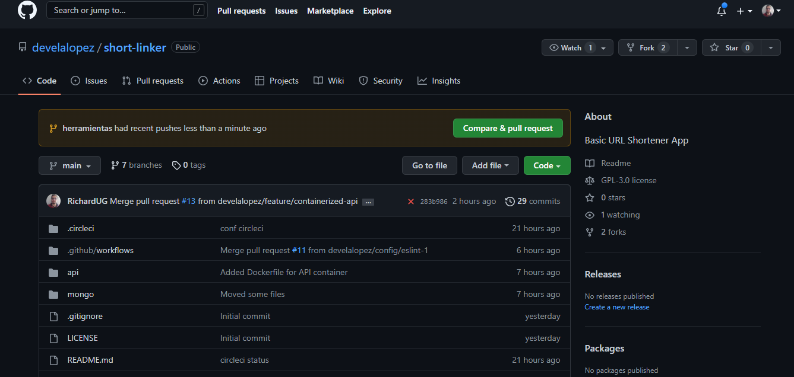
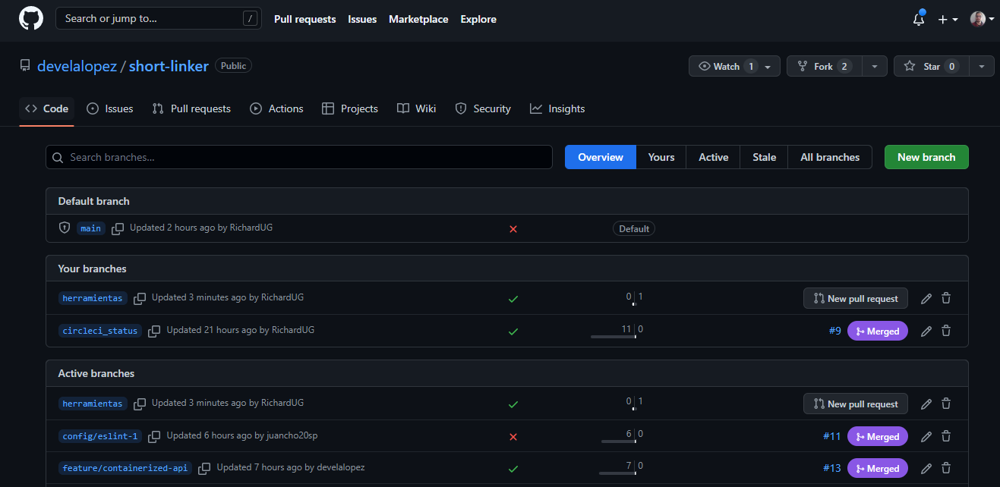
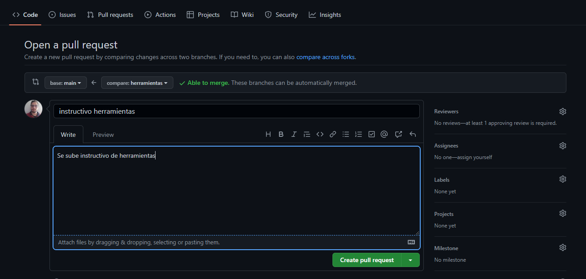
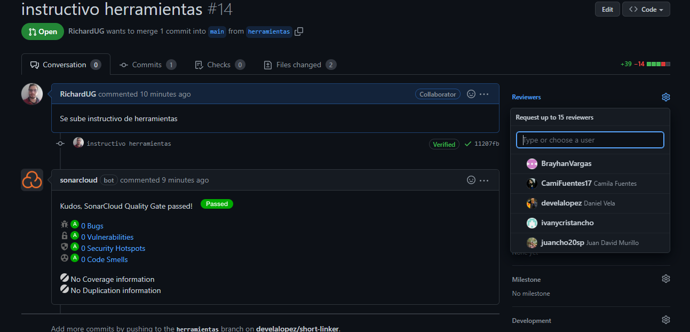
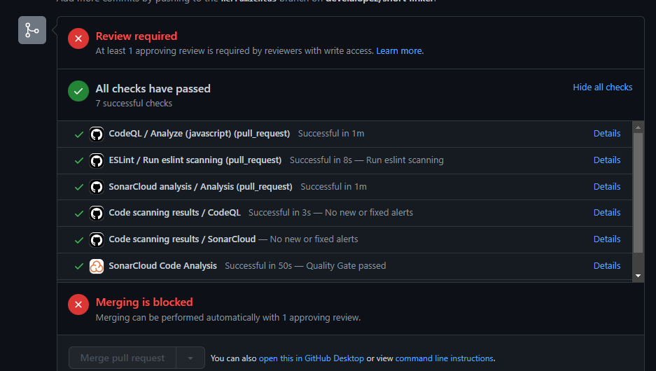

# ¿Como trabajaras con nosotros?

Hay un par de cosas que tienes que tener en cuenta como es nuestra cultura de trabajo

## ¿Como puedo obtener el codigo?

Ejecuta el siguiente comando en tu consola de comandos

    git clone https://github.com/develalopez/short-linker.git

Si aún no cuentas con acceso al repositorio, [envía un correo a Daniel Vela](mailto:de.vela.lopez@gmail.com)

## ¿Como puedo ejecutar los entornos de desarrollo?

    docker compose up

## ¿Que estrategia de colaboración usamos?

Trabajamos con una estrategia de [GitHub Flow](https://docs.github.com/es/get-started/quickstart/github-flow), con la cual cada integrante puede trabajar de manera mas libre y que se puedan hacer despliegues de manera más regular

## ¿Como puedo subir mi codigo?

Tienes que tener en cuenta que por seguridad y praticas DevSecOps nada se va a subir directamente a la rama main, por lo cual debes seguir los siguientes pasos

* Crea tu rama de trabajo

        git checkout -b "tu_nombre_de_rama"

* Agrega cambios a tu git local

      git add .

* Guarda esos cambios en un commit, recuerda que para hacer uso de la función "-S" debes de haber configurado tu firma digital gpg [¿Como hacerlo?](seguridad.md)
  
        git commit -m "tu commit" -S

* Sube los cambios a tu rama
  
      git push -u origin "tu_nombre_de_rama"

## ¿Que sigue?

Ahora tienes que hacer un pull request para subir los cambios que realizaste en tu rama hacia main, sigue los siguientes pasos:

* Ve a "branches"

  

* Ahora identifica tu rama y dale en la opción "New pull request"
  
  

* Una vez acá puedes enviar un comentario acerca del pull request que estas planeando enviar y para continuar, oprime en "Create pull request"

  

* Al enviar el pull request se necesitara que alguien apruebe el cambio, para solictar un revisor selecciona la opción reviewrs y selecciona el revisor que desees
  
  

* A peesar de que aun no se haya aprobado por un revisor, las pruebas se iran ejecutando y te daran un resultado
  
  

## ¿Que puedo hacer si soy revisor de un pull request?

