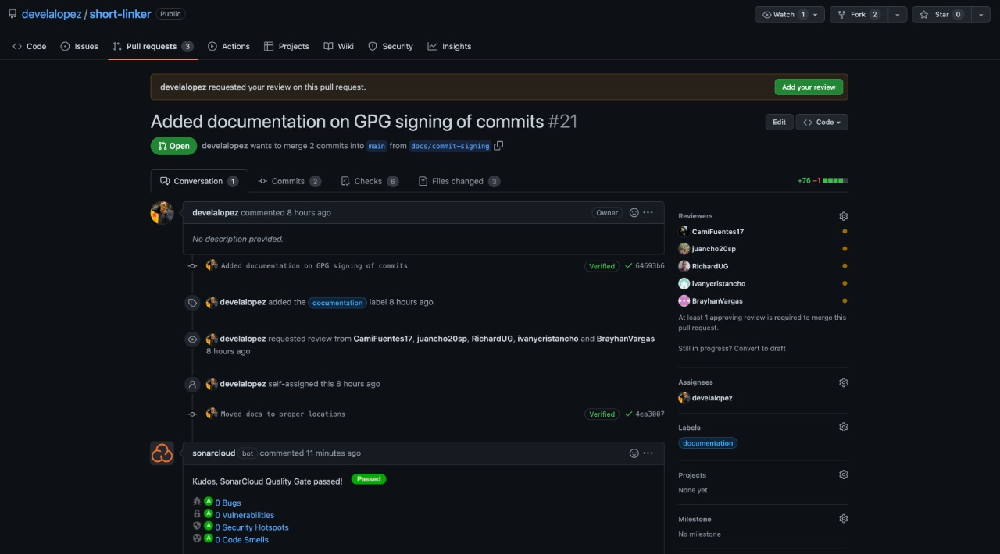
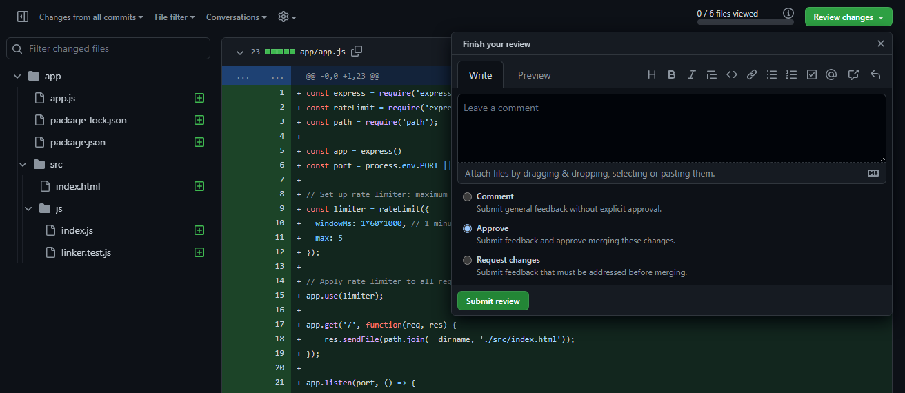
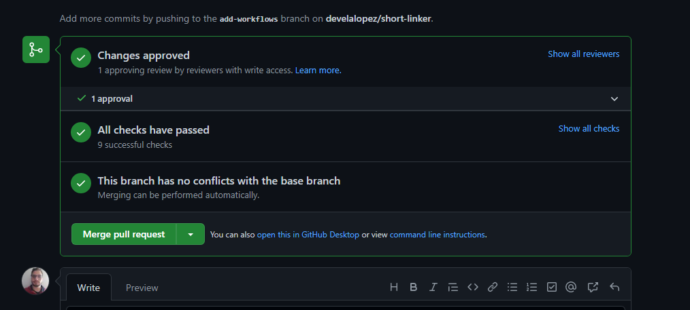
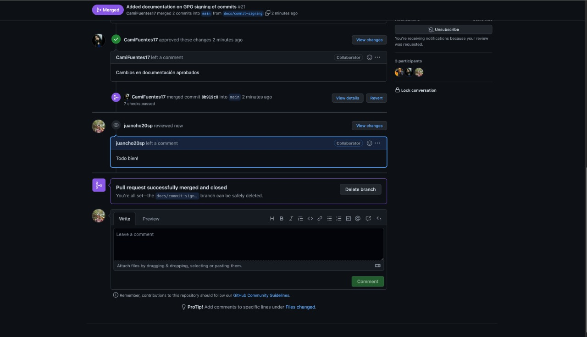

# ¿Comó trabajaras con nosotros?

Hay un par de cosas que tienes que tener en cuenta como es nuestra cultura de trabajo, pero no te preocupes, te lo explicaremos en seguida

## ¿Qué estrategia de colaboración usamos?

Trabajamos con una estrategia de [GitHub Flow](https://docs.github.com/es/get-started/quickstart/github-flow), con la cual cada integrante puede trabajar de manera mas libre y que se puedan hacer despliegues de manera más regular

## ¿Cómo usar las funcionalidades de mis compañeros?

Si necesitas las funcionalidades de tus compañeros, simplemente utiliza el siguiente comando

    git pull origin main

## ¿Cómo puedo subir mi codigo?

Tienes que tener en cuenta que por seguridad y praticas DevSecOps nada se va a subir directamente a la rama main, por lo cual debes seguir los siguientes pasos

* Crea tu rama de trabajo

        git checkout -b "tu_nombre_de_rama"

* Agrega cambios a tu git local

      git add .

* Guarda esos cambios en un commit, recuerda que para hacer uso de la función "-S" debes de haber configurado tu firma digital gpg [¿Como hacerlo?](seguridad.md)
  
        git commit -m "tu commit" -S

* Sube los cambios a tu rama
  
      git push -u origin "tu_nombre_de_rama"

## ¿Qué sigue?

Ahora tienes que hacer un pull request para subir los cambios que realizaste en tu rama hacia main, sigue los siguientes pasos:

* Ve a "branches"

  

* Ahora identifica tu rama y dale en la opción "New pull request"
  
  

* Una vez acá puedes enviar un comentario acerca del pull request que estas planeando enviar y para continuar, oprime en "Create pull request"

  

* Al enviar el pull request se necesitara que alguien apruebe el cambio, para solictar un revisor selecciona la opción reviewrs y selecciona el revisor que desees
  
  

* A pesar de que aun no se haya aprobado por un revisor, las pruebas se iran ejecutando y te daran un resultado
  
  

## ¿Cómo puedo revisar un pull request?

¡Es sencillo! solo debes seguir los siguientes pasos

* En este caso te dirigiras al pull request que necesita ser aprobado y oprime en "Add your review"

  

* Ahora acá podras observar los cambios que se realizaron, para mirar las opciones oprime en "Review changes" y veras que puedes aprobar el cambio, realizar un comentario o pedir requerimientos adicionales para aprobarlo

  

* Finalemente si has aprobado los cambios y todas las pruebas han sido satisfactorias veras que puedes realizar un "merge pull request" para asociar a la rama principal

  

* Ahora si lo has realizado verás una pantalla como la siguiente, en la cual mostrara la unión hacia trunk

  

### **Eso es todo, si tienes cualquier duda no dudes en contactrarnos, recuerda que somos un equipo**